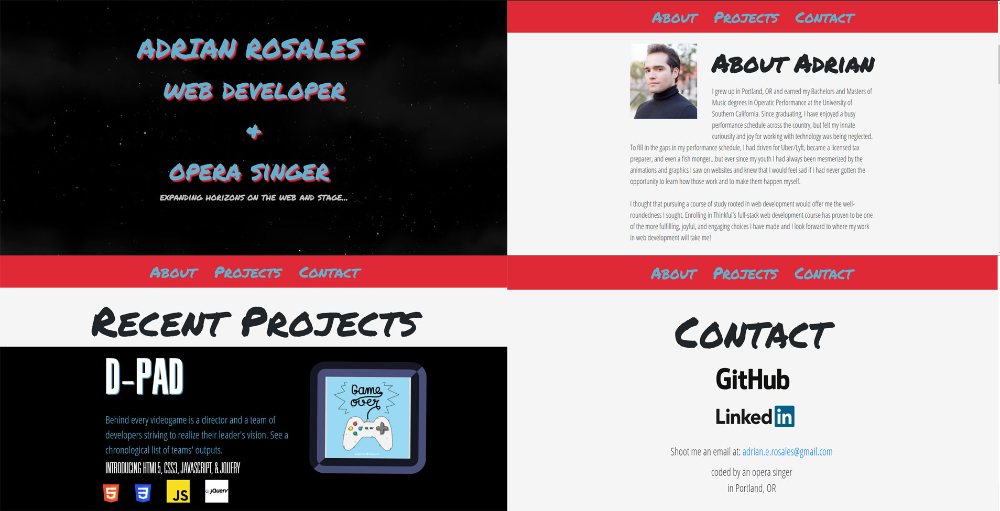

<h1>Adrian Rosales' Full Stack Web Developer Portfolio Site</h1>

<a href='https://agitated-mcnulty-8bb0dc.netlify.com/'>Adrian Rosales (Web Developer + Opera Singer)</a> is my portfolio page for my work as a full-stack web developer.

##GETTING STARTED

#Visit
> Go to <a href='https://agitated-mcnulty-8bb0dc.netlify.com/'>This site</a>.

<h2>Introduction</h2>

This is my portfolio site for my work as a full stack web developer. It serves as an introduction to who I am, my journey from classical music performance to web development, and as a hub to all of my projects so far that I have created through Thinkful's web development course. I hope you enjoy my work, continue to visit for future projects and updates to current ones, and consider hiring me to help you with whatever you need.

<h2>Technology</h2>
<h3>Front End</h3>
<ul>
  <li>HTML5</li>
  <li>CSS3</li>
  <li>JavaScript</li>
  <li>jQuery</li>
 </ul>
<h3>Deployment</h3>
<ul>
	<li>Netlify</li>
</ul>